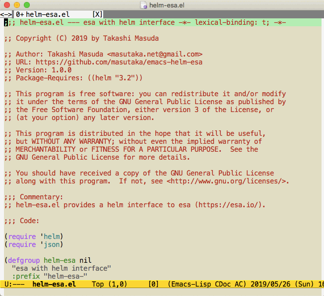

# helm-esa.el

[![melpa badge][melpa-badge]][melpa-link]
[![melpa stable badge][melpa-stable-badge]][melpa-stable-link]

[melpa-link]: https://melpa.org/#/helm-esa
[melpa-stable-link]: https://stable.melpa.org/#/helm-esa
[melpa-badge]: https://melpa.org/packages/helm-esa-badge.svg
[melpa-stable-badge]: https://stable.melpa.org/packages/helm-esa-badge.svg

## Introduction

`helm-esa.el` is a helm interface for [esa](https://esa.io/).

You can open esa articles to the web browser using helm interface.

## Screenshot



## Requirements

* Emacs 26.2 or higher
* helm 3.2 or higher
* curl

## Installation

You can install `helm-esa.el` from [MELPA](https://melpa.org) with package.el (`M-x package-install helm-esa`).

## Setup

```lisp
(setq helm-esa-team-name "Your esa team name")
(setq helm-esa-access-token "Your Access Token") ;; See https://{team_name}.esa.io/user/applications
(helm-esa-initialize)
```

The required scope is `Read` for `helm-esa-access-token`.

## Usage

### `helm-esa`

* A function to be able to select the searched esa articles

### `helm-esa-source`

* A helm source for the searched esa articles

### `helm-esa-search-query`

* Query for searching esa articles

You can customize it. e.g;

```lisp
(setq helm-esa-search-query "watched:true -in:日報")
```

The default value is `"watched:true kind:stock"`.

See also [help/記事の検索方法 \- docs\.esa\.io](https://docs.esa.io/posts/104).
